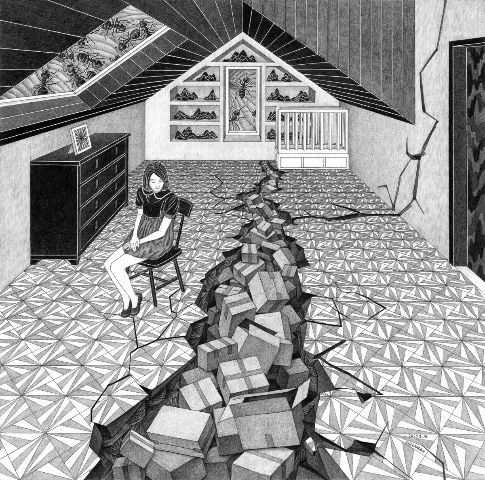

## 2020 CiGA Game Jam - [08/14, 08/16]

# 消费主义

题图有一种陷入消费主义陷阱的迷茫，我们这次的思路是希望，能通过让大家从第一人称的生产者角度，来理解和体会消费主义背后的商业机器，和每个个体扮演的角色。

-观音山老年活动中心

[项目介绍](https://www.youxibd.com/gamejam/cgjcyber2020/detail/439)

[宣传视频](https://www.bilibili.com/video/BV1uk4y127Vo)

[体验地址](https://yunhsiao.github.io/GGJ-20/build/web-mobile)

[国内体验地址](https://yunhsiao.gitee.io/ggj-20)
